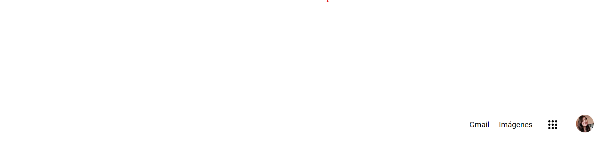
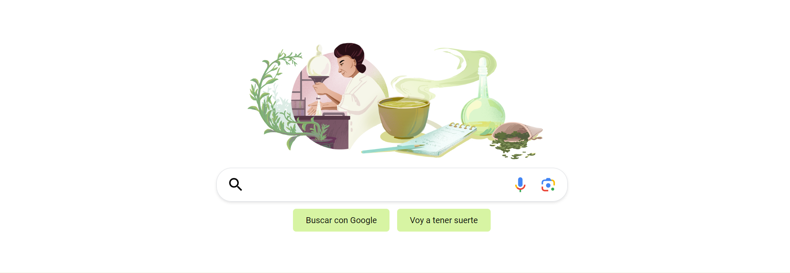
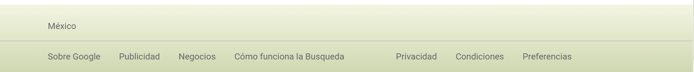

# Clon de Google: Tecnolochicas PRO

Este proyecto fue creado durante el bootcamp Technolochicas PRO, es un clon del buscador de Google responsivo (adaptable a diversos dispositivos).

El propósito de la creación de este sitio web es mostrar el conocimiento en como estructurar una página web. Demostrar el entendimiento del modelo de caja y el display. Se ordenó el contenido del sitio para que todo luzca como el buscador de Google. 
Incluye: header, main (con varias secciones dentro de este) y footer. 
Es una página web responsiva. 
Incluye recusrsos multimedia
<a href="https://silly-ganache-c074c8.netlify.app/" target="_blank">Visit Now 🚀 </a>

# Secciones (Capturas de pantalla)

 **Header**: Contiene enlaces directos a varios servicios populares de Google. Estos suelen incluir Gmail (correo electrónico), Imágenes (Google Images), además el conocido ícono que usualmente despliega un menú con el resto de los servicios de Google (en este caso no). Y por último mi foto de perfil de mi cuenta de Google. 

 **Main**: Aqí encontramos primero un doodle de google del 133º aniversario del nacimiento de Michiyo Tsujimura una  la educadora y bioquímica japonesa.
 El campo de búsqueda se encuentra en el centro de la página, los usuarios escriben sus consultas en este campo y luego pueden hacer clic en el botón "Buscar" para realizar la búsqueda. Se encuentra también el ícono del micrófono que permite a los usuarios realizar búsquedas por voz. 
 **Footer**: se encuentra en la parte inferior y contiene información adicional y enlaces a otros servicios o secciones de la compañía.

  # Tecnologías

## Agradecimientos

Agradezco a Tecnolochicas PRO, Santander, Fundación Televisa y Microsoft por la beca proporcionada, por su apoyo y mentoría a Malinali y Anel, que siempre estuvieron para apoyarme en el desarrollo de este proyecto.

## Contacto

Si estás interesado en compartir o contactar para algun proyecto u oportunidad laboral, contáctame. 

<a href="https://www.linkedin.com/in/gaby-elena-arteaga-ochoa/"></img></a>

© 2023 Gaby Arteaga 